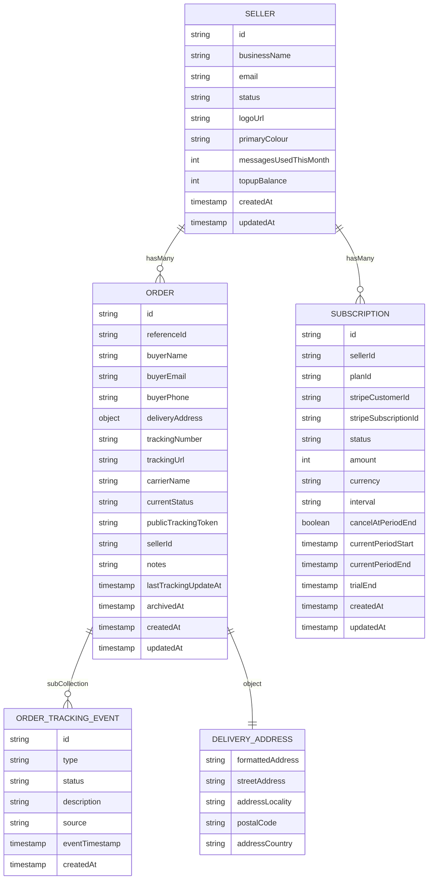

# Project: get-drop.io-frontend (Next.js Pages Router + Firebase + npm)

## Repository Truth (Use This, Not Generic Templates)

- Router style: Next.js Pages Router (`src/pages`) - not App Router.
- UI stack: MUI + Emotion - not Tailwind.
- Firebase client/server modules live under `src/utils/firebaseServer`.
- Package manager: npm only.
- TypeScript strict mode is enabled.

## Current Folder Layout

- `src/pages`: Route files (`index.tsx`, `about.tsx`, `_app.tsx`, `_document.tsx`, `404.tsx`).
- `src/config`: App-wide config (for example, MUI theme in `theme.ts`).
- `src/utils/firebaseServer/firebaseClient.ts`: Browser Firebase SDK entrypoint.
- `src/utils/firebaseServer/firebaseServer.ts`: Server-only Firebase Admin SDK entrypoint.
- `src/utils/firebaseServer/firebaseconfig/firebaseConfig.ts`: Client Firebase config.
- `src/utils/firebaseServer/firebaseconfig/useEmulators.ts`: Client emulator connector.
- `src/utils/firebaseServer/firebaseconfig/adminConfig.ts`: Admin init config.
- `src/utils/firebaseServer/firebaseconfig/useAdminEmulators.ts`: Admin emulator connector.
- `docs`: Product and architecture docs.

## Project Structure To Uphold (Feature-Based)

Use a feature-based structure as the default mental model and implementation standard.

```text
src/
├── features/
│   ├── auth/
│   │   ├── components/
│   │   ├── hooks/
│   │   ├── services/
│   │   ├── store/
│   │   ├── types/
│   │   └── index.ts
│   ├── orders/
│   ├── dashboard/
│   └── ...
├── shared/
│   ├── components/
│   ├── hooks/
│   ├── store/
│   ├── types/
│   ├── utils/
│   └── layouts/
├── pages/
└── utils/
```

### Structure Rules

1. Group code by business feature/domain first (for example `auth`, `orders`, `dashboard`), not by technical layer at the top level.
2. Each feature should own its components, hooks, services, types, and feature-local state.
3. Use `shared/` only for cross-feature primitives that are truly reused and stable.
4. Keep `pages/` focused on route composition and wiring; business logic should live in `features/`.
5. Use a feature `index.ts` as a public entry point when it improves import clarity.
6. Avoid moving code to `shared/` prematurely; prefer feature-local until reused across features.
7. When introducing new features, follow this pattern unless there is a strong repo-specific reason not to.

### Tradeoffs

- Pros: easier feature ownership, better scalability, cleaner onboarding, improved modularity.
- Cons: possible duplication across features; requires discipline to keep `shared/` minimal and meaningful.

## Tech Constraints

- Framework: Next.js 16 with React 19.
- Styling: MUI + Emotion with `styled` components as the default for reusable UI/layout.
- Backend services: Firebase (Firestore/Auth/Storage) with emulator-first local workflow.
- Lint/format: ESLint + Prettier.

## Styling Rules

1. Prefer `styled` from `@mui/material/styles` for reusable components and layout wrappers.
2. Keep `sx` for one-off page composition tweaks, not for reusable component internals.
3. When building reusable layout primitives, use typed style props and `shouldForwardProp` to avoid leaking custom props to the DOM.
4. Preserve existing design language (spacing scale, typography, and color direction) when refactoring styles.
5. Do not introduce Tailwind or alternate styling systems unless explicitly requested.
6. If `styled` is used, prefer styling MUI components (for example `styled(Box)`, `styled(Typography)`, `styled(Button)`) instead of raw HTML tags.

## Theme Source of Truth

1. Do not invent ad-hoc colors, font sizes, spacing scales, or typography values in component files.
2. Use style values from `src/config/theme.ts` only (palette, typography, `designSystemColors`, `layoutGrid`, and theme spacing/breakpoints).
3. Avoid raw hex values and hardcoded typography tokens unless adding them first to `src/config/theme.ts`.
4. If a required token does not exist, add it to `src/config/theme.ts` and then consume it from there.
5. Prefer references to theme tokens inside `styled` blocks and `sx` objects instead of literal values.

## Data Model Source of Truth (ERD)

1. The canonical entity relationship diagram lives in `docs/ERD.md`.
2. Treat this ERD as the schema contract for Firestore collections, subcollections, and embedded objects.
3. Current model relationships are:
   - `SELLER ||--o{ ORDER : hasMany`
   - `SELLER ||--o{ SUBSCRIPTION : hasMany`
   - `ORDER ||--o{ ORDER_TRACKING_EVENT : subCollection`
   - `ORDER ||--|| DELIVERY_ADDRESS : object`

### Canonical ERD Snapshot



### Schema Synchronization Rules

1. When any schema field or relationship changes in code, update `docs/ERD.md` in the same change.
2. Keep TypeScript domain types aligned with ERD entities:
   - `src/types/User.ts` for `SELLER`
   - `src/types/Order.ts` for `ORDER`, `DELIVERY_ADDRESS`, and `ORDER_TRACKING_EVENT`
   - query-layer mirrors such as `src/queries/orders/types.ts`
3. Keep Firestore write payloads and validators aligned with ERD-required fields.
4. For `order_tracking_event`, require and validate `type`, `status`, `description`, and `source` before writes.
5. If a field is added, removed, renamed, or type-changed, update all impacted docs, types, mapping utilities, and validation code in the same PR.

## Firebase Rules for Coding

1. Never initialize Firebase directly inside page/component files.
2. Client code must import Firebase services from `src/utils/firebaseServer/firebaseClient.ts`.
3. Server-only code must import Admin SDK helpers from `src/utils/firebaseServer/firebaseServer.ts`.
4. Keep emulator routing behavior intact:
   - Client toggle: `NEXT_PUBLIC_USE_FIREBASE_EMULATORS`
   - Server toggle: `USE_FIREBASE_EMULATORS`
5. Do not hardcode live project endpoints in UI code.

## Environment and Emulator Rules

1. Local development uses `.env.local`.
2. For browser access, only `NEXT_PUBLIC_*` environment variables are valid.
3. Prefer local-safe defaults in emulator mode when possible.
4. Keep docs aligned with `readmeforemulators.md` when emulator workflow changes.

## Coding Standards

1. Keep changes minimal and scoped to the request.
2. Preserve existing naming and import style in surrounding files.
3. Avoid introducing new patterns (state libs, CSS frameworks, architecture) unless asked.
4. No `any`; use explicit types for Firebase payloads and function contracts.
5. If logic is reused, move it into utility/config modules rather than duplicating in pages.
6. Wrap awaited async operations in `try/catch` and handle failure states explicitly in the calling flow.
7. For input forms, add `onKeyDown` keyboard navigation behavior between fields (for example: next field on Enter or ArrowDown, previous field on ArrowUp) when it makes sense for UX, including iOS keyboard navigation.

## Commands to Use

- `npm run dev`: Start Next.js dev server.
- `npm run dev:emulators`: Start Firebase emulators (Firestore/Auth/Storage).
- `npm run dev:emulators:all`: Start all configured emulators.
- `npm run lint`: Run lint checks.
- `npm run build`: Production build.

## Agent Behavior Notes

1. Treat this file as source of truth for project layout.
2. If paths in docs/code differ from this file, update docs to match the real filesystem.
3. Before introducing structural refactors, verify directories actually exist in this repo.
