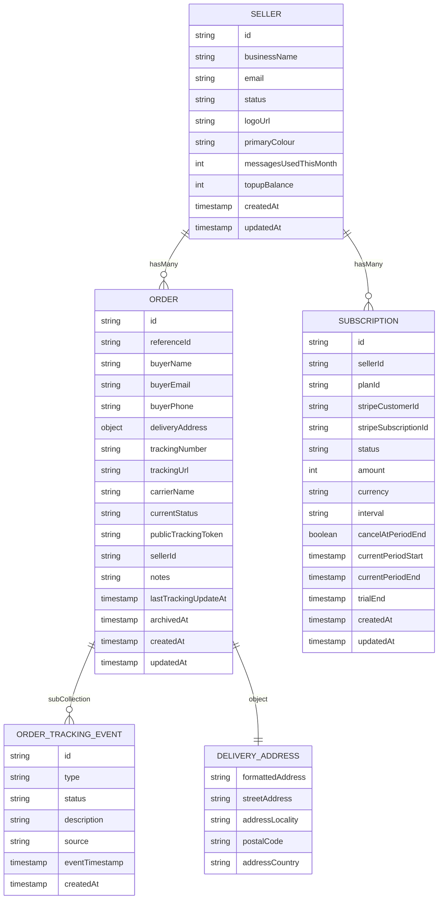

# ERD

```mermaid
erDiagram
    SELLER ||--o{ ORDER : hasMany
    SELLER ||--o{ SUBSCRIPTION : hasMany 
    ORDER ||--o{ ORDER_TRACKING_EVENT : subCollection
    ORDER ||--|| DELIVERY_ADDRESS : object

    SELLER {
        string id
        string businessName
        string email
        string status
        string logoUrl
        string primaryColour
        int messagesUsedThisMonth
        int topupBalance
        timestamp createdAt
        timestamp updatedAt
    }

    ORDER {
        string id
        string referenceId
        string buyerName
        string buyerEmail
        string buyerPhone
        object deliveryAddress
        string trackingNumber
        string trackingUrl
        string carrierName
        string currentStatus
        string publicTrackingToken
        string sellerId
        string notes
        timestamp lastTrackingUpdateAt
        timestamp archivedAt
        timestamp createdAt
        timestamp updatedAt
    }

    DELIVERY_ADDRESS {
        string formattedAddress
        string streetAddress
        string addressLocality
        string postalCode
        string addressCountry
    }

    ORDER_TRACKING_EVENT {
        string id
        string type
        string status
        string description
        string source
        timestamp eventTimestamp
        timestamp createdAt
    }

    SUBSCRIPTION {
        string id
        string sellerId
        string planId
        string stripeCustomerId
        string stripeSubscriptionId
        string status
        int amount
        string currency
        string interval
        boolean cancelAtPeriodEnd
        timestamp currentPeriodStart
        timestamp currentPeriodEnd
        timestamp trialEnd
        timestamp createdAt
        timestamp updatedAt
    }
```